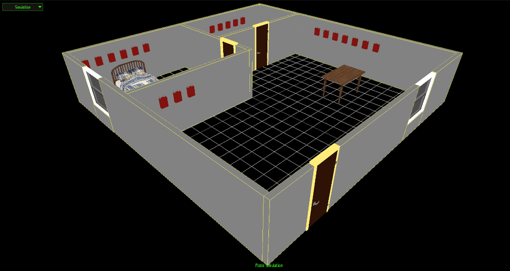
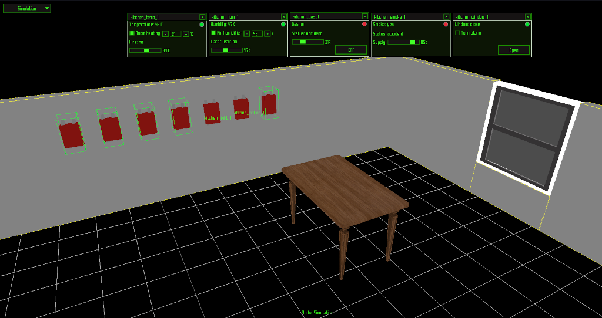
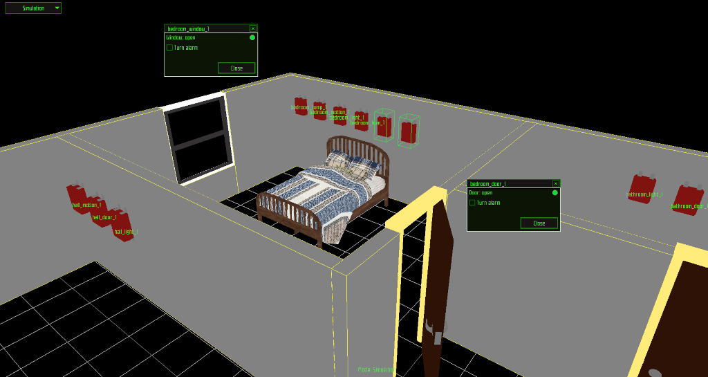

# Hometexis

## About the Project
(project for the university)

This project is a prototype of a smart home digital twin.

The main goal of the project is to demonstrate skills in building client-server interactions, as well as approaches to designing and modeling digital twins. 
The project is primarily educational and focuses on exploring architectural solutions 
for smart home management and simulation systems.

### Features

- Basic digital twin model  
- Client-server interaction  
- Usage of low-level libraries for higher performance and greater system control  

### Description

The project demonstrates principles of developing efficient software for monitoring, controlling, and simulating smart home behavior.

### Screenshot

General idea of ​​a digital twin

Sensor management tools

Window and door control

## Tech Stack

- C++
- Client-Server Architecture
- raylib
- raygui
- ixwebsocket
- SQLite / SQLiteCpp
- nlohmann/json
- Linux

## Future Plans

- Expand system functionality  
- Improve digital twin simulation accuracy  
- Extend client-server features  
- Optimize performance and architecture  
- Add new smart home devices and scenarios
